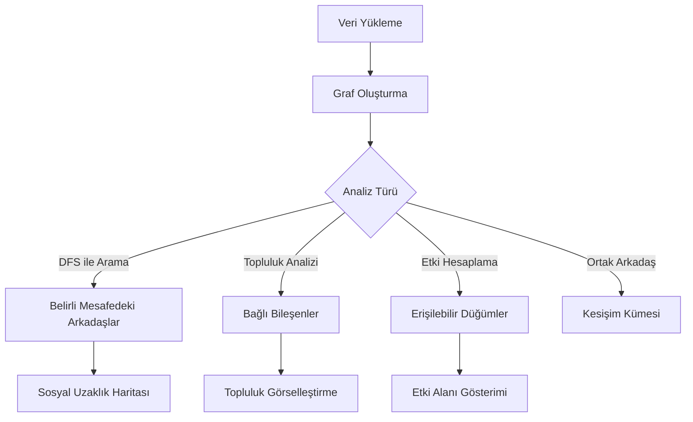

# 🌐 Sosyal Ağ Analiz Sistemi


**Sosyal Ağ Analiz Sistemi**, ağaç ve graf tabanlı veri yapıları kullanarak sosyal ağları modelleyen ve analiz eden kapsamlı bir C uygulamasıdır. Bu proje, arkadaşlık ilişkilerinin grafiksel temsili ve analizi için güçlü algoritmalar kullanarak sosyal bağlantıları derinlemesine incelemenizi sağlar.

## 📑 İçindekiler

- [Proje Hakkında](#-proje-hakkında)
- [Sistem Görselleştirmesi](#-sistem-görselleştirmesi)
- [Özellikler](#-özellikler)
- [Teknolojiler](#-teknolojiler)
- [Kurulum](#-kurulum)
- [Kullanım](#-kullanım)
- [Veri Seti Formatı](#-veri-seti-formatı)
- [Veri Yapıları ve Algoritmalar](#-veri-yapıları-ve-algoritmalar)
- [Örnek Çıktılar](#-örnek-çıktılar)
- [Katkıda Bulunma](#-katkıda-bulunma)
- [Lisans](#-lisans)

## 🌟 Proje Hakkında

Bu proje, sosyal ağ analitiği alanındaki çeşitli algoritmik problemlere çözüm sunmak için C dilinde geliştirilmiştir. Sistem, kullanıcılar arasındaki ilişkileri graf yapısı olarak temsil eder ve çeşitli ağaç tabanlı veri yapıları kullanarak analizler gerçekleştirir. 

Kırmızı-siyah ağaç veri yapısı kullanarak kullanıcı aramalarını optimize eder ve DFS (Derinlik Öncelikli Arama) algoritması ile belirli mesafedeki arkadaşlıkları, ortak bağlantıları ve toplulukları belirler.

## 🖼 Sistem Görselleştirmesi

### Sosyal Ağ Grafiği (Tam Bağlantı Görünümü)


*Şekil 1: Tüm bağlantılar ile sosyal ağ grafiği. Toplulukların nasıl birbirine bağlandığını ve izole düğümleri gösterir.*

### Topluluk Yapısı Görünümü


*Şekil 2: Topluluk yapısı görünümü. Kullanıcıların nasıl kümeler oluşturduğunu ve hiyerarşik ilişkileri gösterir.*

### Sosyal Ağ Analiz Akışı



*Şekil 3: Sistem analiz akışı ve temel işlevler.*

## 🔑 Özellikler

- **İlişki Ağacı Görselleştirme**: Kullanıcılar için hiyerarşik arkadaşlık ilişkilerini gösterir
- **Derinlik Öncelikli Arama (DFS)**: Belirli bir mesafedeki arkadaşları hızlıca bulma
- **Ortak Arkadaş Analizi**: İki kullanıcı arasındaki ortak bağlantıları tespit etme
- **Topluluk Tespiti**: Sosyal ağdaki bağlantılı grupları (toplulukları) bulma
  - Topluluk 1: 101, 102, 103, 104, 105 (dairesel bağlantı)
  - Topluluk 2: 106, 107, 108 (tam bağlı üçgen)
  - Topluluk 3: 109, 110, 111, 112 (zincir ve çember)
  - Topluluk 4: 113, 114 (ikili bağlantı)
  - İzole kullanıcı: 115
- **Etki Alanı Hesaplama**: Bir kullanıcının ağ üzerindeki toplam erişimini değerlendirme
- **Kırmızı-Siyah Ağaç Aramaları**: Dengeli bir veri yapısı kullanarak hızlı kullanıcı erişimi
- **Otomatik Veri Yükleme**: Metin dosyası formatında dış veri seti desteği

## 💻 Teknolojiler

- C Programlama Dili
- Graf Veri Yapısı
- Ağaç Tabanlı Veri Yapıları:
  - Kırmızı-Siyah Ağaç
  - DFS için Yığın (Stack)
  - BFS için Kuyruk (Queue)

## 🚀 Kurulum

### Gereksinimler
- GCC Derleyici
- Standard C Kütüphanesi
- Make (isteğe bağlı)

### Adımlar

1. Projeyi klonlayın:
   ```bash
   git clone https://github.com/kullaniciadi/sosyal-ag-analizi.git
   cd sosyal-ag-analizi
   ```

2. Programı derleyin:
   ```bash
   gcc -o sosyal_ag main.c -Wall
   ```

   veya Make kullanarak:
   ```bash
   make
   ```

3. Programı çalıştırın:
   ```bash
   ./sosyal_ag
   ```

## 📊 Kullanım

Program çalıştırıldığında interaktif bir menü ile karşılaşacaksınız:

```
=== MENÜ ===
1. İlişki ağacı oluşturma (kullanıcılar için)
2. Belirli mesafedeki arkadaşları bul (DFS)
3. Ortak arkadaş analizi
4. Topluluk (community) tespiti
5. Etki alanı (influence) analizi
6. Kırmızı-Siyah Ağacı ile kullanıcı arama
7. Kırmızı-Siyah Ağacı sıralı listele (Inorder)
0. Çıkış
```

### Ana İşlevler

- **İlişki Ağacı Görüntüleme**: Bir kullanıcıdan başlayarak arkadaşlık hiyerarşisini gösterir
- **DFS ile Mesafe Analizi**: Belirli bir kullanıcıdan belirli derinlikteki tüm arkadaşları listeler
- **Ortak Arkadaş Analizi**: İki kullanıcı arasındaki ortak bağlantıları gösterir
- **Topluluk Tespiti**: Ağdaki bağlantılı kullanıcı gruplarını (toplulukları) ve izole kullanıcıları tespit eder
- **Etki Analizi**: Bir kullanıcının doğrudan veya dolaylı olarak ulaşabileceği tüm kullanıcıları ve toplam etki alanını gösterir
- **Kırmızı-Siyah Ağaç Aramaları**: ID tabanlı hızlı kullanıcı araması sağlar

### Örnek Komut Akışı

1. Programı başlatın
2. Veri setini yükleyin (`veriseti.txt`)
3. Sosyal ağ analizi yapmak için menüden bir seçenek seçin
4. Sonuçları analiz edin

## 📝 Veri Seti Formatı

Program, aşağıdaki formatta bir metin dosyasını (`veriseti.txt`) okuyabilir:

```
# Kullanıcılar
USER [kullanıcı_id]
USER [kullanıcı_id]
...

# Arkadaşlık ilişkileri
FRIEND [kullanıcı_id1] [kullanıcı_id2]
FRIEND [kullanıcı_id1] [kullanıcı_id2]
...
```

**Örnek veri seti:**

```
# Kullanıcılar
USER 101
USER 102
USER 103
...

# Topluluk 1 (Beşli dairesel, iç bağlantı)
FRIEND 101 102
FRIEND 102 103
FRIEND 103 104
...
```

## 🧮 Veri Yapıları ve Algoritmalar

### Temel Veri Yapıları

1. **User Yapısı**: 
   ```c
   typedef struct User {
       int id;
       struct User* friends[MAX_FRIENDS];
       int friend_count;
   } User;
   ```

2. **Stack (DFS için)**:
   ```c
   typedef struct StackNode {
       User* user;
       int depth;
       struct StackNode* next;
   } StackNode;
   ```

3. **Kırmızı-Siyah Ağaç**:
   ```c
   typedef struct RBTreeNode {
       int user_id;
       User* user_ptr;
       Color color;
       struct RBTreeNode *left, *right, *parent;
   } RBTreeNode;
   ```

### Algoritma Karmaşıklık Analizi

| Algoritma | İşlem | Zaman Karmaşıklığı |
|-----------|-------|-------------------|
| DFS | Ağ Taraması | O(V + E) |
| Topluluk Tespiti | Bağlı Bileşenler | O(V + E) |
| RB-Tree Arama | Kullanıcı Bulma | O(log N) |
| RB-Tree Ekleme | Kullanıcı Ekleme | O(log N) |
| Ortak Arkadaş | Kesişim Hesaplama | O(N) |

*V: Düğüm (kullanıcı) sayısı, E: Kenar (arkadaşlık) sayısı, N: Maksimum arkadaş sayısı*

### Ana Algoritmalar

- **DFS (Derinlik Öncelikli Arama)**: Belirli mesafelerde arkadaş bulma ve etki alanı hesaplama için
- **BFS (Genişlik Öncelikli Arama)**: İlişki ağacını seviyeler halinde göstermek için
- **Topluluk Tespiti**: Bağlantılı bileşenler algoritması kullanılarak toplulukları tespit etme
- **Kırmızı-Siyah Ağaç**: Dengeli ikili arama ağacı ile O(log n) zaman karmaşıklığında kullanıcı aramaları

## 📸 Örnek Çıktılar

### Topluluk Tespiti

```
Topluluk 1 (Üyeler: 101, 102, 103, 104, 105)
Topluluk 2 (Üyeler: 106, 107, 108)
Topluluk 3 (Üyeler: 109, 110, 111, 112)
Topluluk 4 (Üyeler: 113, 114)
İzole kullanıcı: 115
```

### Belirli Mesafedeki Arkadaşlar (DFS ile)

```
2 mesafesindeki arkadaş(lar):
ID: 103
ID: 105
```

### Etki Alanı Analizi

```
101 numaralı kullanıcının etki alanı:
ID: 102
ID: 103
ID: 104
ID: 105
Toplam: 4 kişi
```

### Kırmızı-Siyah Ağaç (Inorder Dolaşım)

```
Kullanıcılar ID sırasıyla (Kırmızı-Siyah Ağacı, Inorder):
101 102 103 104 105 106 107 108 109 110 111 112 113 114 115
```

## 🔄 Kırmızı-Siyah Ağaç Görselleştirmesi

```
                107
              /     \
          103         111
         /   \       /    \
      101    105   109     113
        \    /    /  \       \
       102 104   108 110     114
                            /    \
                          112    115
                         /
                       106
```

*Şekil 4: Kırmızı-Siyah Ağaç yapısı*

Bu görselde, sosyal ağ uygulamasında kullanılan kullanıcı kimliklerinin eklenme sırasına göre oluşturulan **kırmızı-siyah arama ağacı** gösterilmektedir.  
Buradaki her düğüm, bir kullanıcıyı temsil eder ve ağacın dengeli yapısı sayesinde kullanıcılar arasında hızlı erişim sağlanır.

> Not: Şemada yalnızca kullanıcı kimlikleri gösterilmiş olup, düğümlerin renkleri belirtilmemiştir.

## 🤝 Katkıda Bulunma

Katkılarınızı memnuniyetle karşılıyorum! Katkıda bulunmak için:

1. Bu projeyi fork edin
2. Kendi branch'inizi oluşturun (`git checkout -b feature/amazing-feature`)
3. Değişikliklerinizi commit edin (`git commit -m 'Add some amazing feature'`)
4. Branch'inizi push edin (`git push origin feature/amazing-feature`)
5. Pull Request açın

## 🔍 Gelecek Geliştirmeler

- [ ] Grafiksel kullanıcı arayüzü (GUI) (kesin değil)
- [ ] Daha gelişmiş topluluk tespit algoritmaları
- [ ] Ağ metriklerinin (merkezilik, yoğunluk, vs.) hesaplanması

## 📄 Lisans

Bu proje, özgürce kullanılabilir ve paylaşılabilir. Kodu değiştirebilir, geliştirebilir ve ticari olmayan projelerinizde kullanabilirsiniz. Ancak, projenin yazarı olarak her zaman yazarı belirtmeniz rica olunur.

---

## 📬 İletişim

Proje ile ilgili sorularınız için:

- GitHub Issues bölümünden soru açabilirsiniz
- E-posta: eneskarakup0074@outlook.com

---

*Bu proje, graf teorisi ve veri yapılarını pekiştirmek amacıyla verilen bir ödev kapsamında geliştirilmiştir.*
